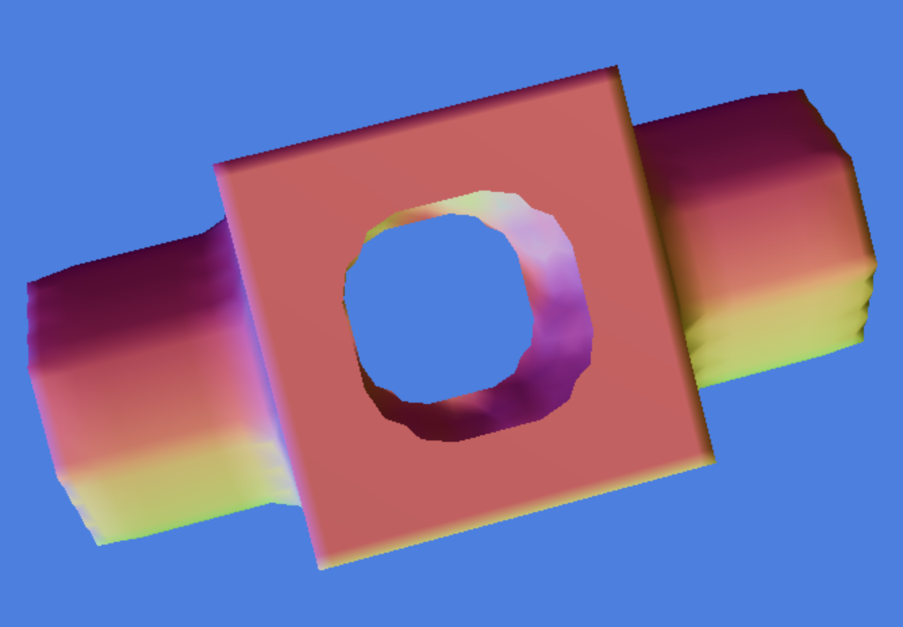

rle-csg
=======
This library implements constructive solid geometry operations for narrowband level sets.  It is part of the [rle family of modules](https://github.com/mikolalysenko/rle-csg) for processing level sets.

Installation
============
Via npm:

    npm install rle-csg

Example
=======
Here is an example showing how to use the library:

    var core  = require("rle-core");
    var csg   = require("rle-csg");
    var cylinder = core.sampleSolid([-20, -20, -20], [20, 20, 20], function(x) {
        return Math.max(Math.abs(x[2]) - 15, Math.sqrt(x[0]*x[0] + x[1]*x[1]) - 5.5);
    });
    var box = core.sampleSolid([-10, -10, -10], [10, 10, 10], function(x) {
      return Math.max(Math.abs(x[0]), Math.abs(x[1]), Math.abs(x[2])) - 7.0;
    });
    var sphere = core.sampleSolid([-10,-10,-10], [10,10,10], function(x) {
      return Math.sqrt(x[0]*x[0]+x[1]*x[1]+x[2]*x[2]) - 8.0;
    });
    var shape = csg.subtract(csg.unite(box, cylinder), sphere);

Which gives you a shape that looks like this:

[If you want to see the result in 3D/WebGL, click here for an interactive demo](http://mikolalysenko.github.com/rle-csg/example/www/index.html)

API
===
To import the library, just do:

    var csg = require("rle-csg");
    
Or you can also just use the methods exposed by rle-all.  There are 4 functions exposed by this library:

## `csg.unite(a, b)`
Computes the set-theoretic union of solids a and b

## `csg.intersect(a, b)`
Intersects solids a and b

## `csg.subtract(a, b)`
Subtracts the solid a from b

## `csg.complement(a)`
Returns the complement of a

Credits
=======
(c) 2013 Mikola Lysenko.  BSD License